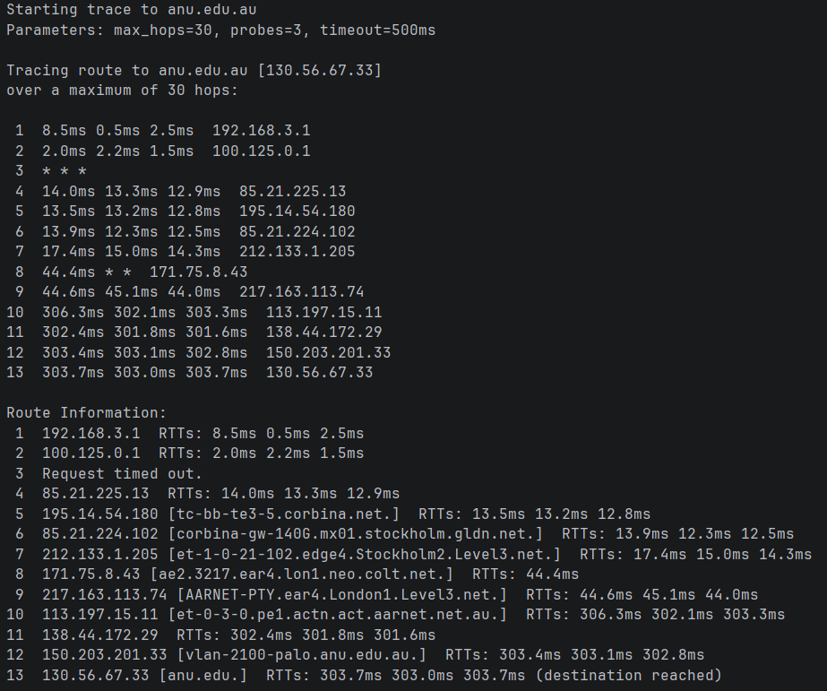
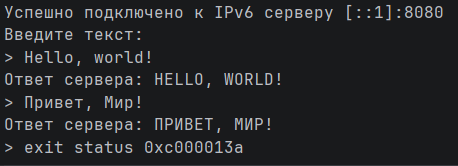
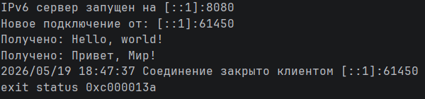

# Практика 10

## Программирование

### Трассировка маршрута с использованием ICMP

Задание реализовано в файле trace.go

#### Демонстрация работы

### Использование протокола IPv6

Задание реализовано в файлах server.go и client.go

#### Демонстрация работы

