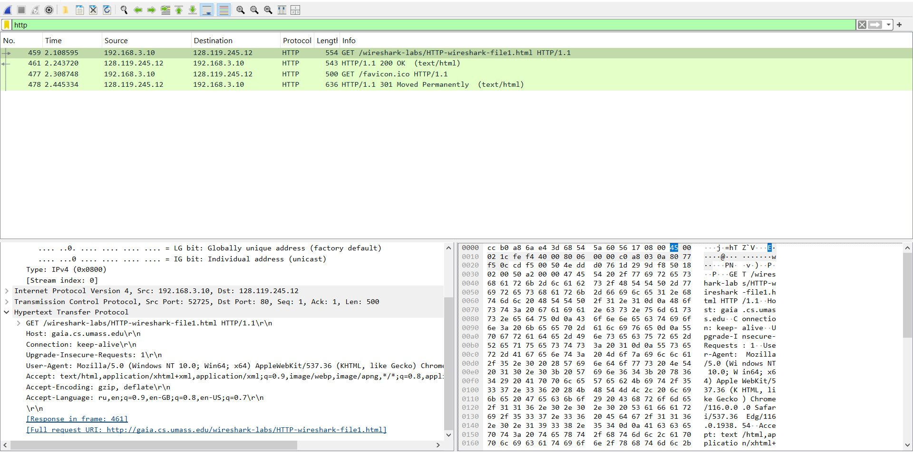
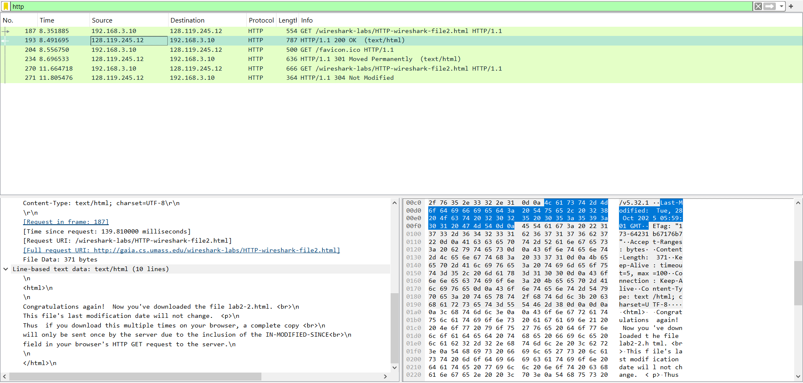
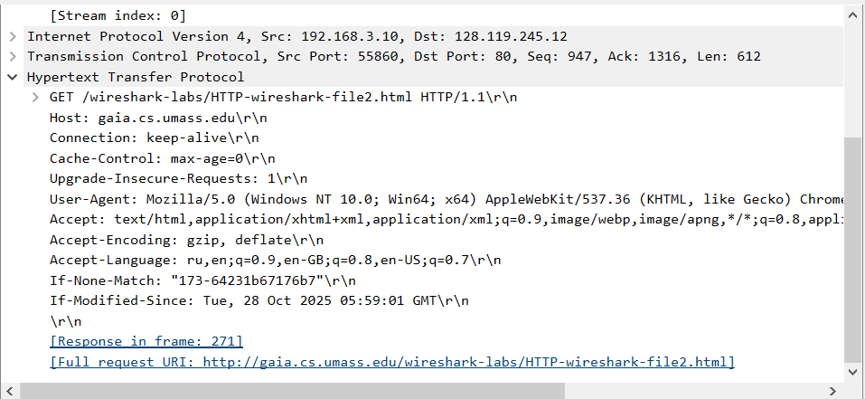
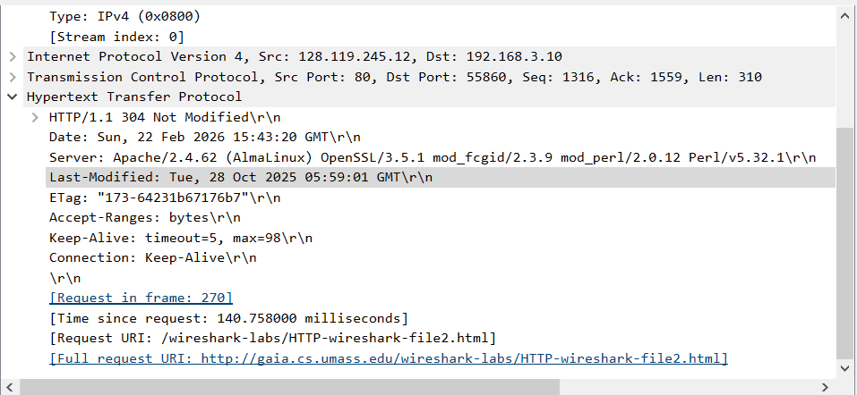
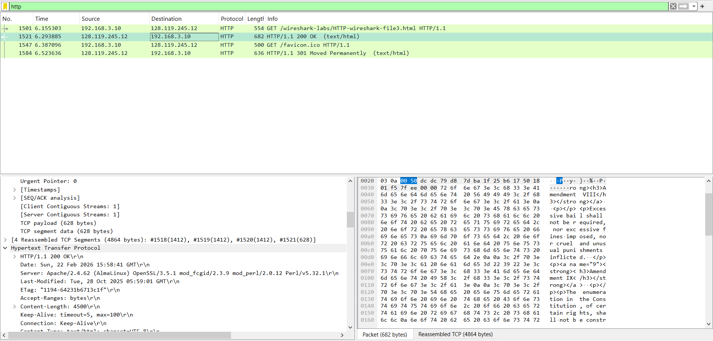
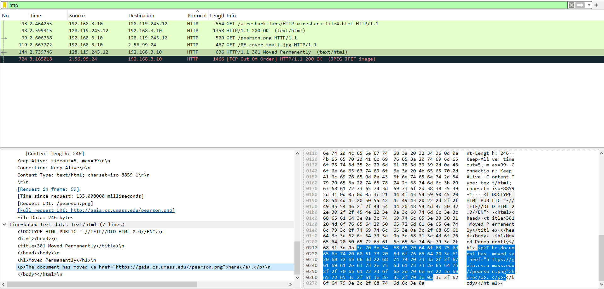
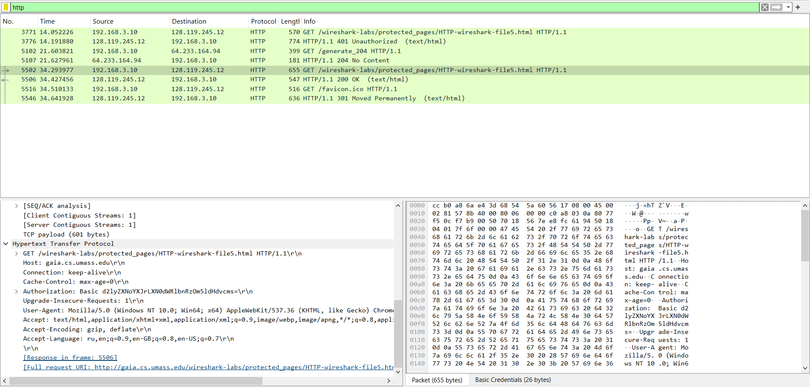

# Практика 1

## Задание 1

### Ответы

1. Мой браузер, как и сервер, использует HTTP версии 1.1
2. Браузер принимает только русский и английский. Также он передаёт серверу операционную систему, версию браузера, и то,
   какие варианты разметок и кодировок он принимает.
3. Мой IP-адрес - 192.168.3.10, IP-адрес сервера - 128.119.245.12
4. Last-Modified: Tue, 28 Oct 2025 05:59:01 GMT
5. Мне приходит 543 байта

## Задание 2

ц
### Ответы

1. Нет, строки IF-MODIFIED-SINCE в первом запросе нет
2. Да, в первый раз сервер вернул ответ явно. В ui wireshark'а мы можем увидеть это в описании пакета в последнем
   разделе
   "Line-based text data: text/html (10 lines)"
3. Да, во второй раз мы видим строку If-Modified-Since: Tue, 28 Oct 2025 05:59:01 GMT. В этом запросе стоит дата
   последнего изменения файла на момент первого запроса.
4. Нет, сервер не вернул содержимое явно. Он вернул ответ 304 Not Modified

## Задание 3

### Ответы

1. Браузер отправил 2 сообщения HTTP GET, но второе из них было не про текст, а про иконку.
2. Код состояния ответа на первый вопрос содержит пакет под номером 1521
3. Для передачи ответа понадобилось 4 пакета TCP под номерами 1518-1521
4. Нет, так как HTTP более высокоуровневый протокол чем TCP, то есть он не должен ничего знать о его работе

## Задание 4

### Ответы

1. Было отправлено 3 GET запроса - 2 на адрес 128.119.245.12, а ещё 1 - на адрес 2.56.99.24
2. Изображения были загружены параллельно, так как оба запроса про изображения (99, 119) были сделаны до первого ответа
   на них (144). Правда в данном случае ответ был лишь переадресацией вопроса к другому серверу, но уже по протоколу
   https.

## Задание 5

1. Ответ сервера на первый запрос - 401 Unauthorized
2. Во второй раз к запросу добавляется поле Authorization, содержащее хэш логина с паролем