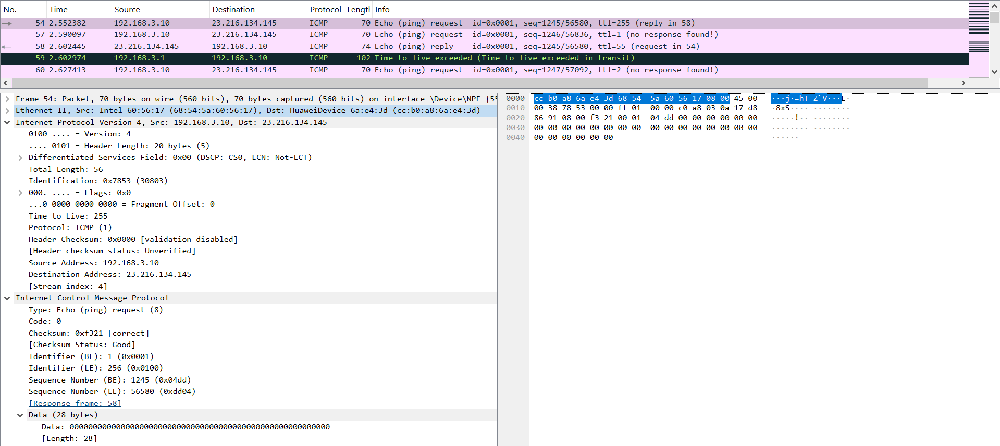
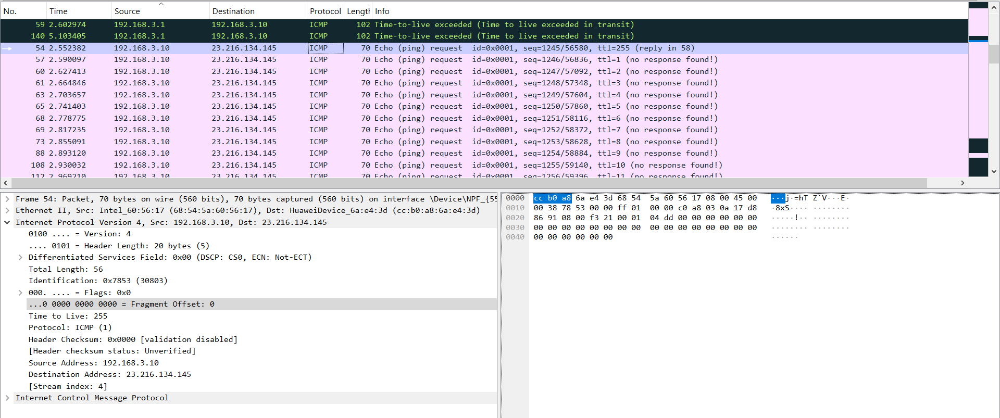
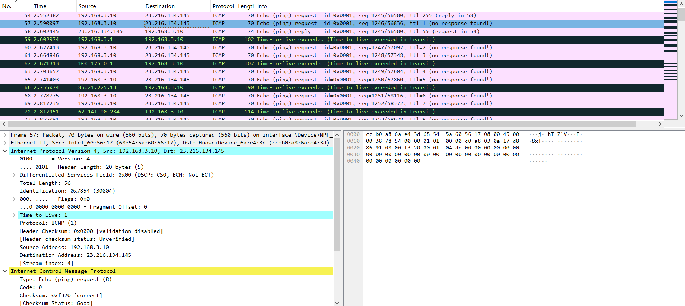
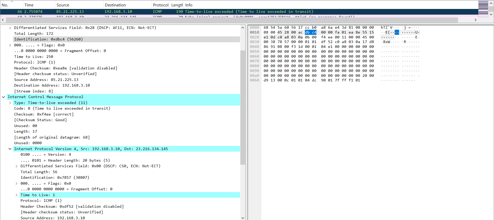
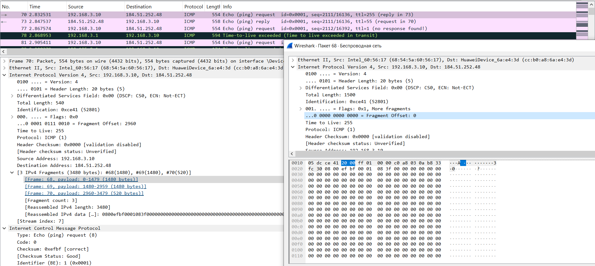

# Практика 10

## Wireshark: IP

### Ответы

1. IP-адрес моего компьютера - 192.168.3.10
2. В поле протокола указано ICMP (1)
3. В IP-заголовке 20 байт. В данном пакете полезная нагрузка IP-дейтаграммы составляет 35 байт.
4. Есть следующие ограничения на поля IP-дейтаграммы:
   * Поле Identification всегда должно изменяться
   * В рамках одного запуска утилиты:
        * Total Length не меняется, потому что зафиксировано в настройках
        * Fragment Offset не меняется, так как каждый пакет - законченное сообщение, т.е. это поле всегда 0
        * Time to Live каждый раз увеличивается на 1 (кроме первого пакета с большим ttl)
        * Protocol - не меняется, всегда ICMP (1)
        * Source и Destination Address - тоже не меняются
   * У меня получилось, что при каждом запуске Identification от пакета к пакету увеличивается на 1. Это поведение не гарантируется, но большинство раз так и будет получаться.
5. У 57-го пакета Identification = 30804, TTL = 1
6. Эти поля самого сообщения об ошибке, очевидно, отличаются. А вот поля копии сообщения, повлёкшего ошибку, устроены так, что Identification совпадает с посланным нами, а TTL всегда равен 1. Случается это потому, что мы видим копию не посланного сообщения, а того сообщения, которое вызвало ошибку при приёме (т.е. у которого TTL = 1). Также это значит, что в сообщениях об ошибке от первого маршрутизатора в цепочке будет точная копия нашего пакета.
7. У 66-го пакета Identification = 56260, TTL = 250. В его копии проблемного сообщения Identification = 30807, TTL = 1
8. Да, сообщение было фрагментировано между 3 IP-дейтаграммами. У всех этих пакетов разный Fragment Offset, а также у последнего пакета не стоит флаг, что после него есть пакеты (в поле Flags).