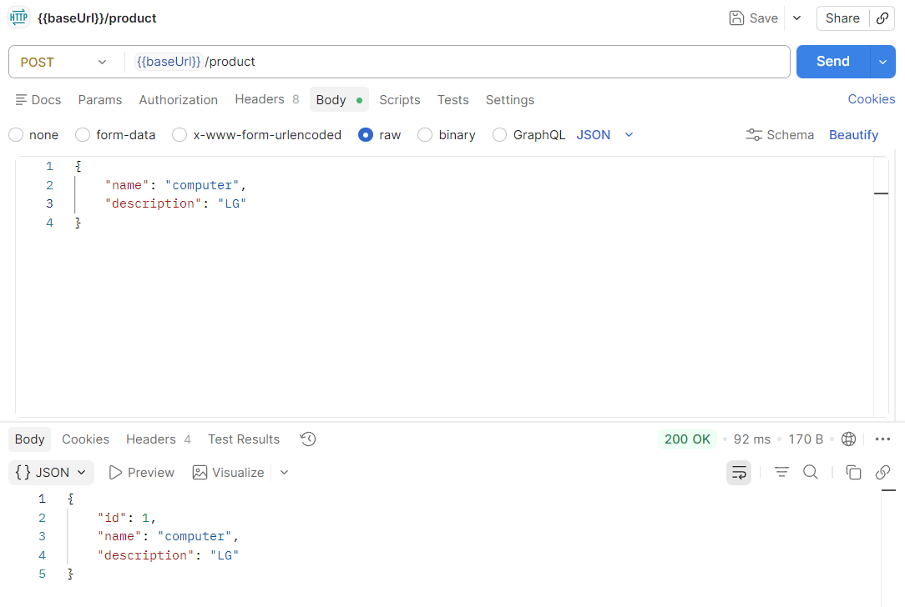
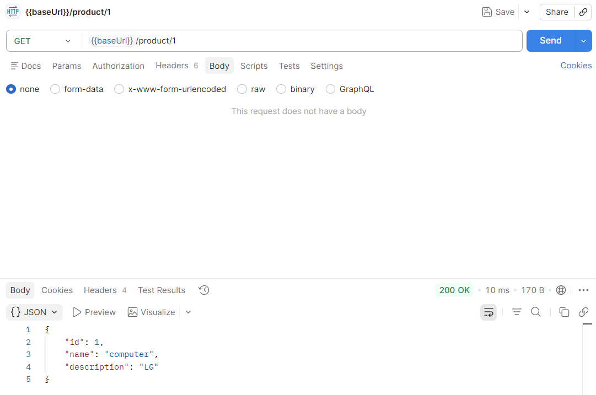
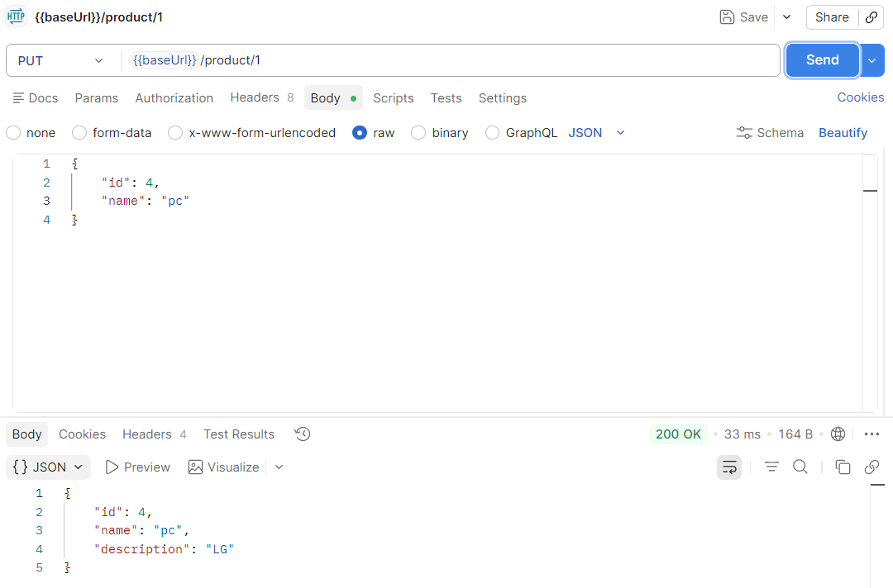
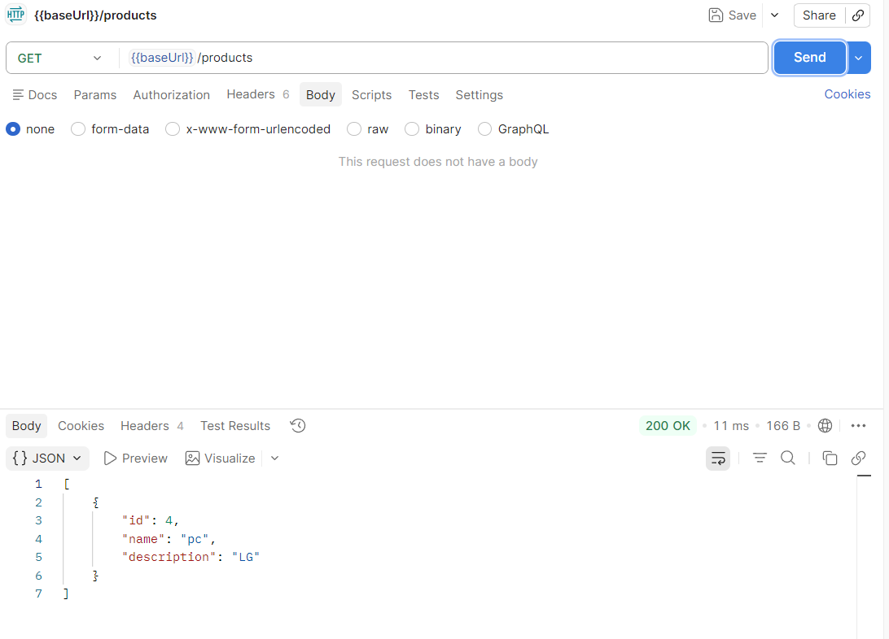
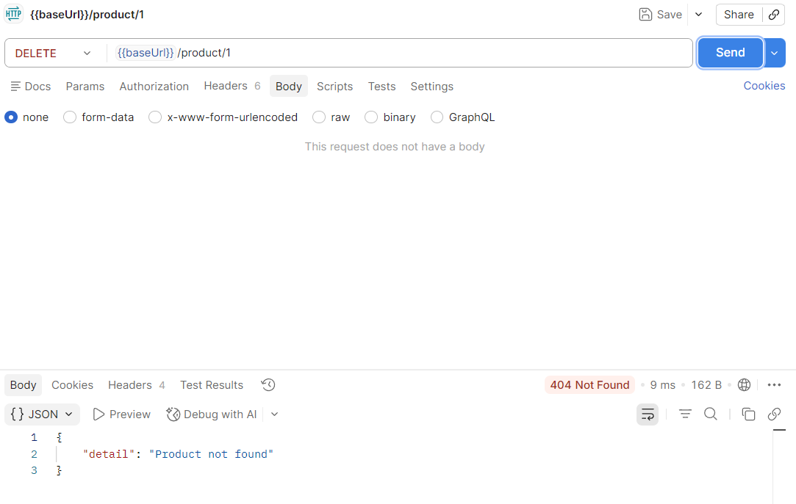
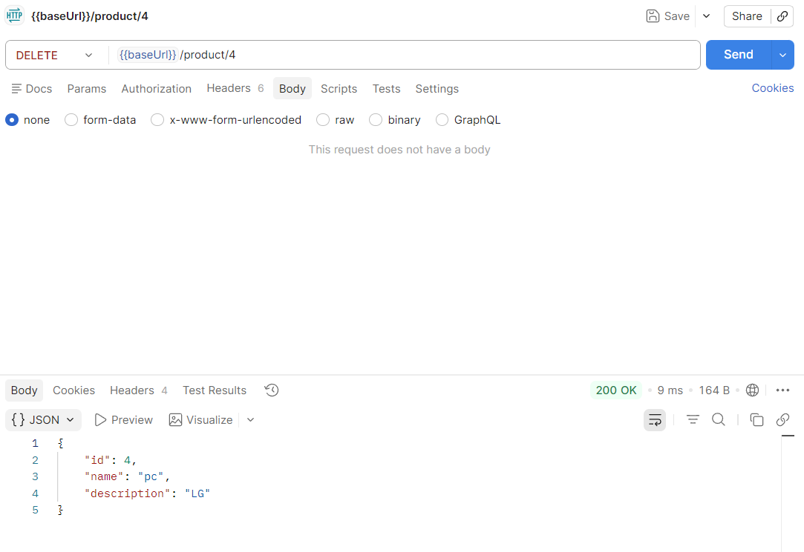
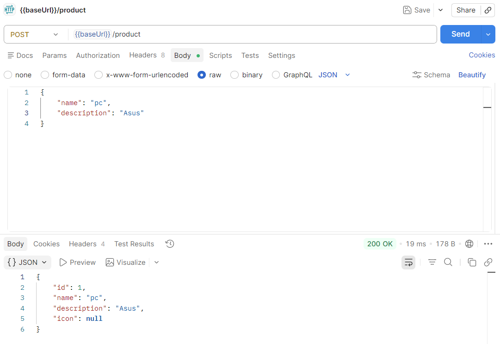
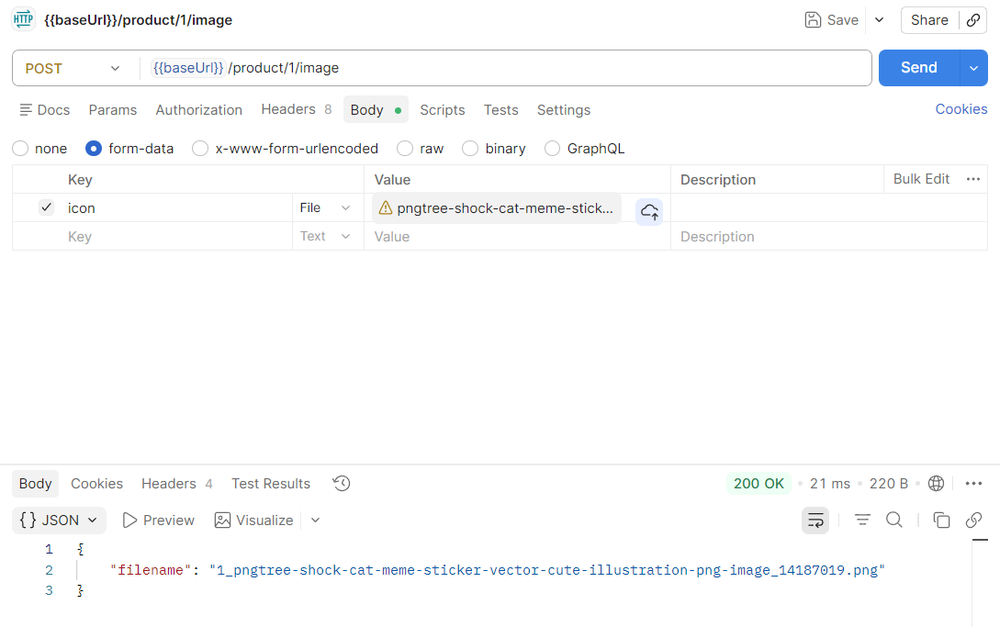
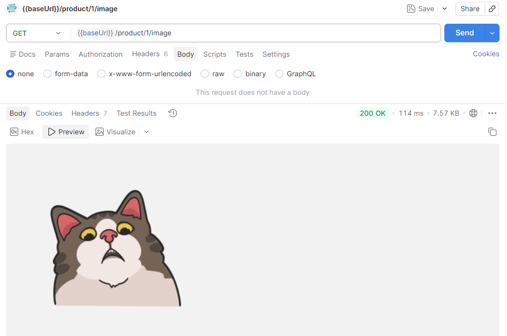
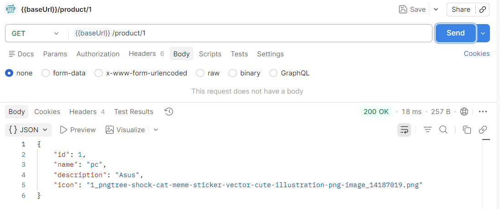

# Практика 1

## Часть 1

### Задание А

Выполнено в main.py

### Задание Б

* POST /product
  
* GET /product/{id}
  
* PUT /product/{id}
  
* PUT /products
  
* DELETE /product/{id}
   

### Задание В

Выполнено в main2.py

#### Демонстрация

* POST /product
  
* POST /product/{id}/image
  
* GET /product/{id}/image
  
* GET /product/{id}
  

## Часть 2

### Задача 1

Если каждое устройство будет отправлять следущий пакет сразу после предыдущего, то задержка последнего пакета
относительно первого составит $(P - 1) \dfrac{L}{R}$, а значит вся пересылка займёт $(N + P - 1) \dfrac{L}{R}$ времени.

Ответ: $(N + P - 1) \dfrac{L}{R}$

### Задача 2

Пусть размер пакета равен $F$, тогда из условия $L = 5$ Мб, $P = \dfrac{L}{F}$.

Тогда один пакет идёт $\sum _i=1 ^3 \frac{F}{R_i}$, а задержка между первым и последним составит $(P-1)
\dfrac{F}{min\{R_i\}}$. В итоге получилось, что чем меньше размер пакета, тем меньше врмени потребует передача. Но,
конечно, такая модель не учитывает ограничения реального мира (например, размер заголовка).

А если подставить $F = L$, то время передачи составит 233 с.

Ответ: 233 с

### Задача 3

Ответ: 0.5 (такая же как встретить динозавра на Невском проспекте)

### Задача 4

$P = \dfrac{X}{S}, T_{transfer} = 3 \dfrac{80 + S}{R}, T_{delay} = (P - 1) \dfrac{80 + S}{R}$

$T = T_{transfer} + T_{delay} = (\dfrac{X}{S} + 2) \dfrac{80 + S}{R} = \dfrac{2S + \dfrac{80X}{S} + 160 + X}{R}$

Известно, что для минимизации функции $T(S)$ нужно взять $S = \sqrt{40X}$.

Ответ: $\sqrt{40X}$

### Задача 5

Пусть $F = \dfrac{L}{R}$, тогда $I = aF, T_{delay} = F\dfrac{I}{1-I}, T_{transfer} = F$

Значит $T = T_{delay} + T_{transfer} = F (1 + \dfrac{I}{1-I}) = \dfrac{F}{1-I}$

Ответ: $\dfrac{F}{1-aF}$