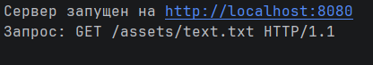
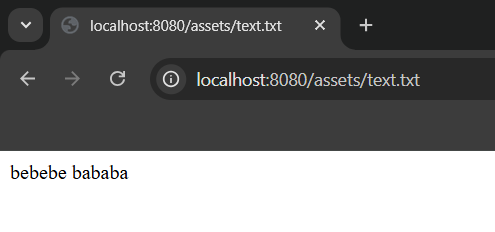
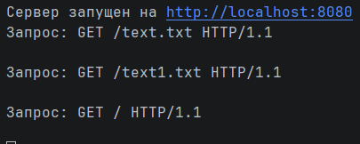
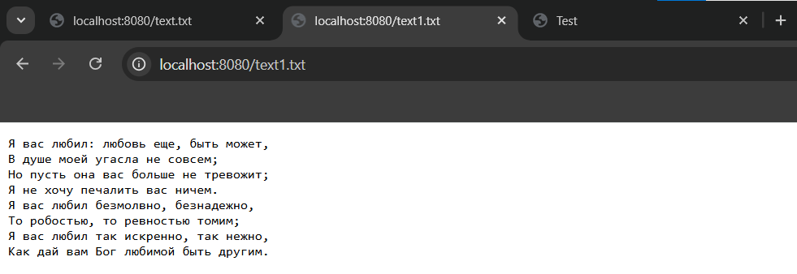
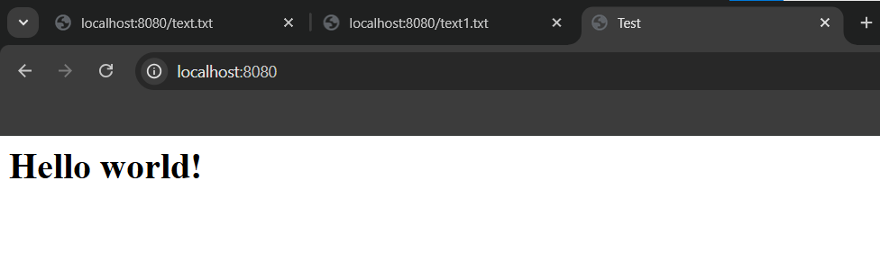
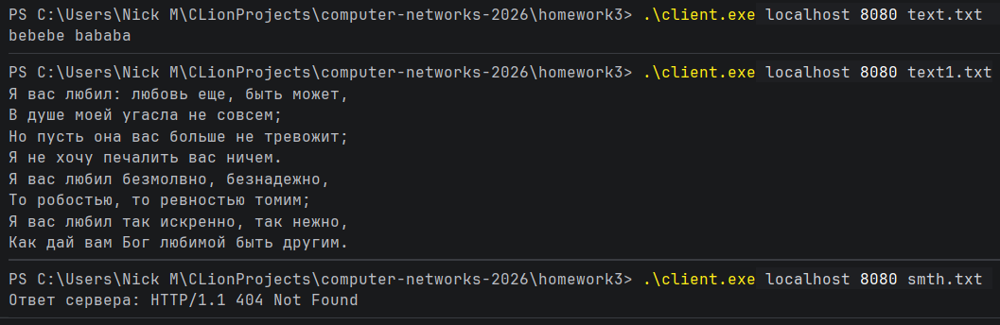
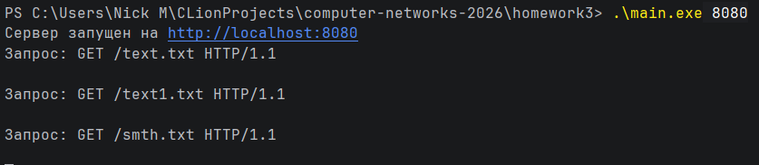

# Практика 3

## Часть 1

Чтобы получить бинарник из файла с кодом достаточно вызвать "go build <файл>"

### Задание А

#### Демонстрация

### Задание Б

Выполнено в main.go

#### Демонстрация

### Задание В

Выполнено в client.go

#### Демонстрация

### Задание Г

Выполнено в server.go

## Часть 2

### Задача 1

Считаем, что время создания бита - это время формирования последнего 56-байтного пакета. Тогда скорость получения
нформации из аналогового источника не влият на ответ. Пакет проходит по каналу между А и Б за $\frac{56}{1048576}$
секунд $\approx \, 53$ мс с задержкой 5 мс.

Ответ: 58 мс