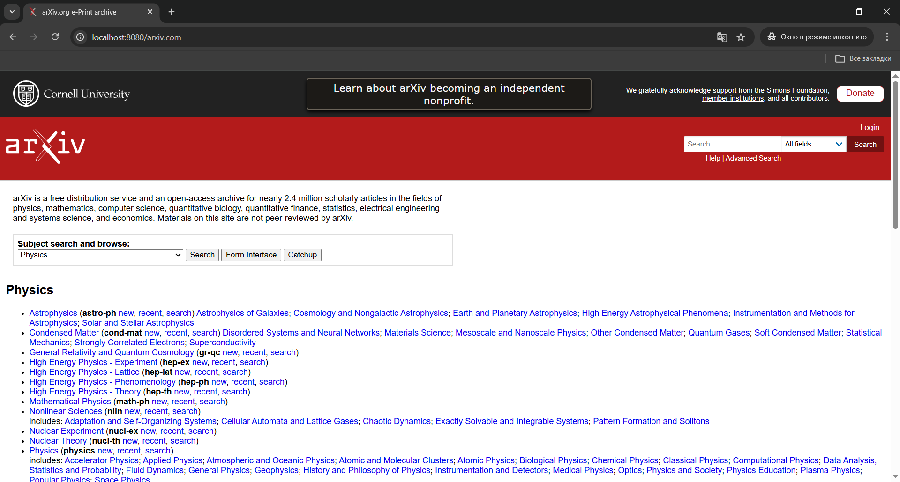
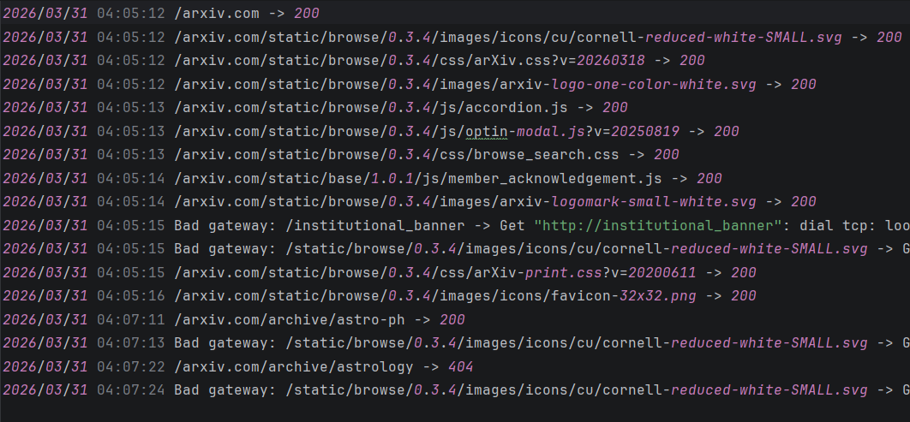
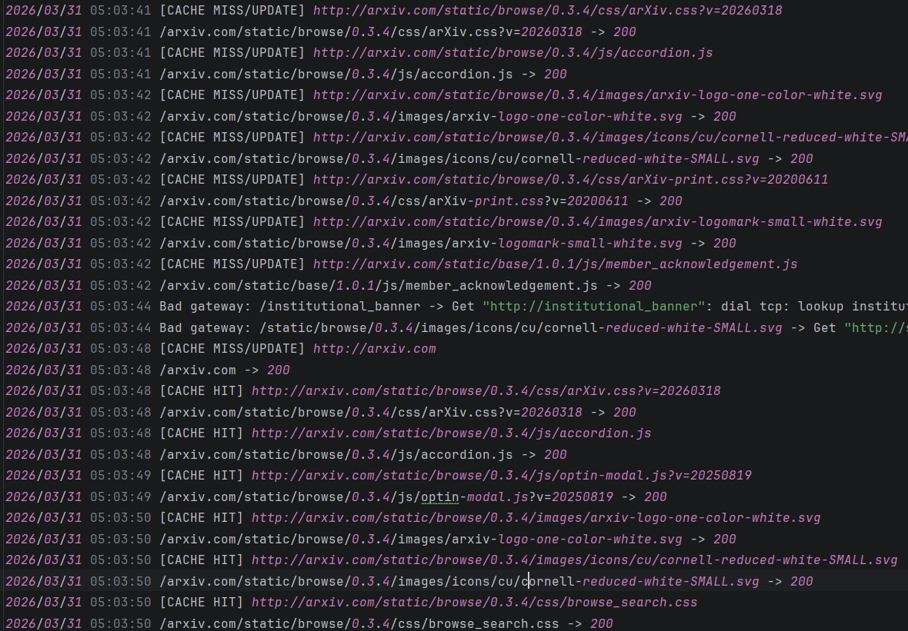
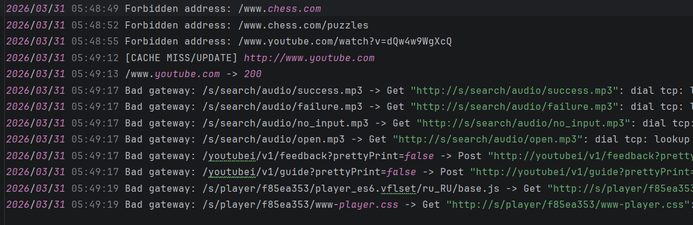
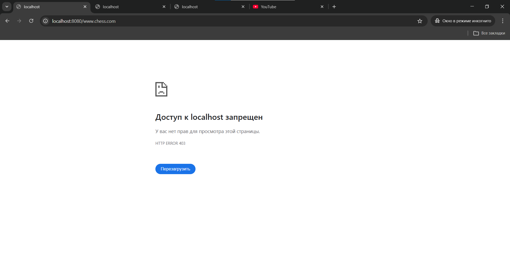
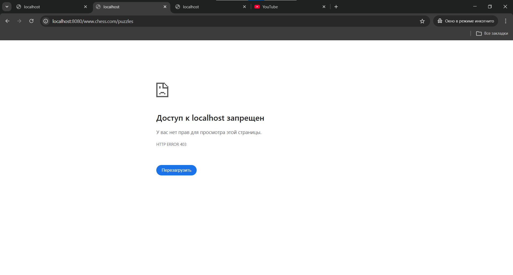
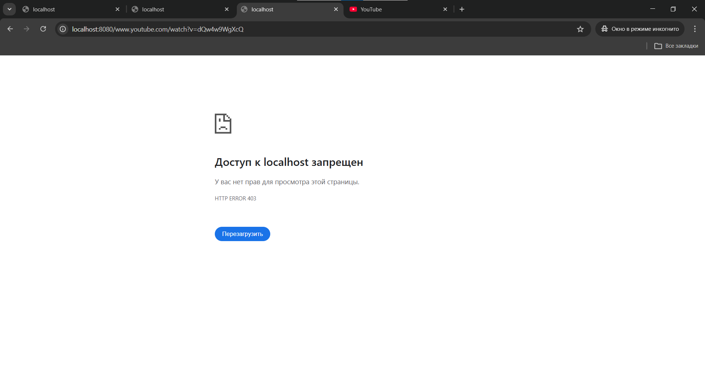
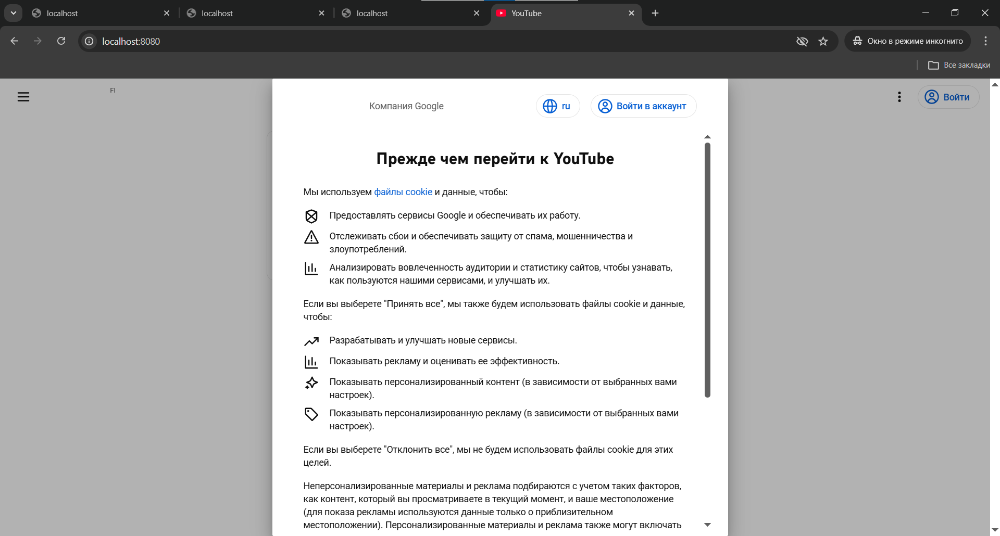

# Практика 4

## Часть 1

Чтобы получить бинарник из файла с кодом достаточно вызвать "go build <файл>"

### Задание А

#### Демонстрация

### Задание Б

#### Демонстрация

### Задание В

Это и предыдущие задания реализованы в main.go

#### Демонстрация

