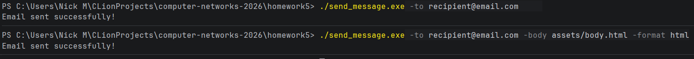
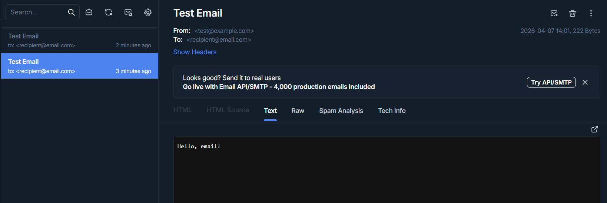
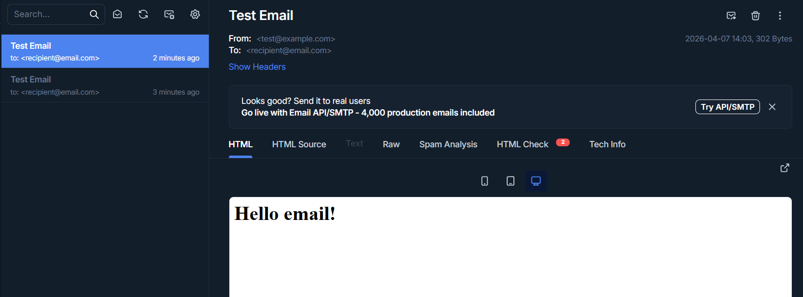
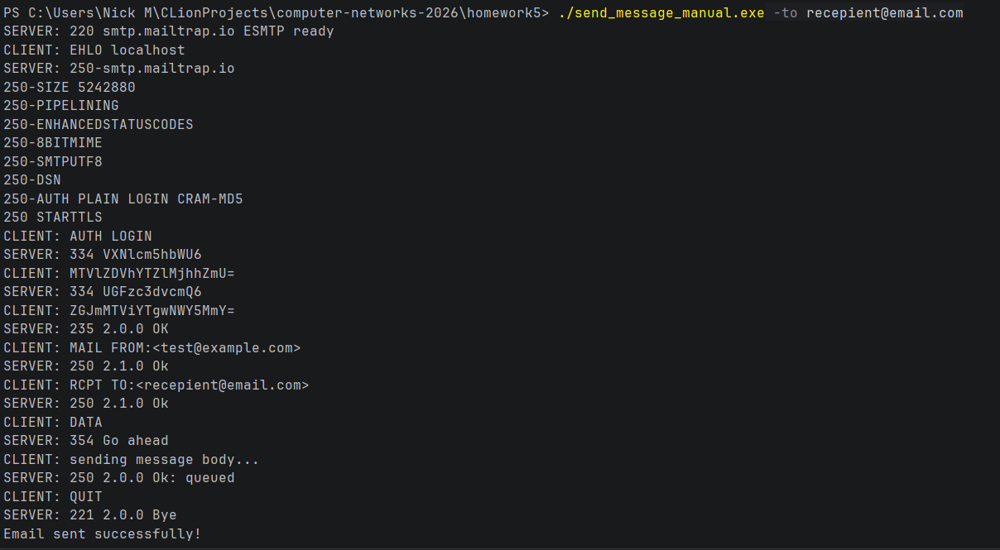
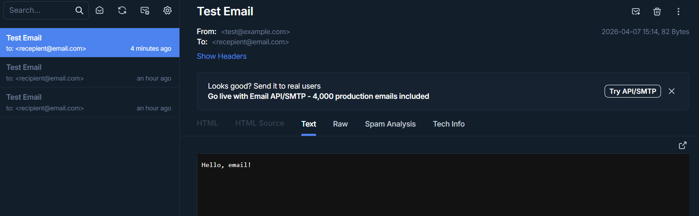
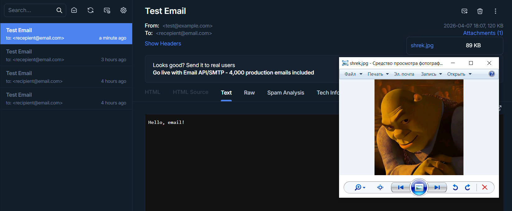
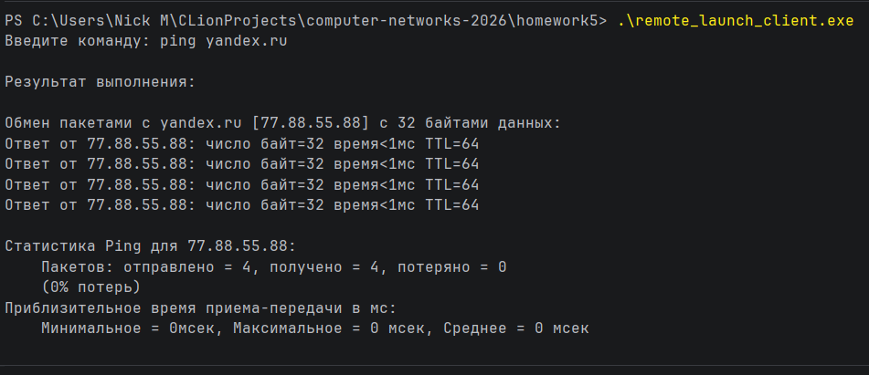
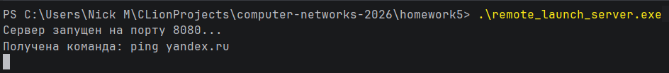
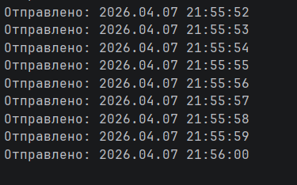
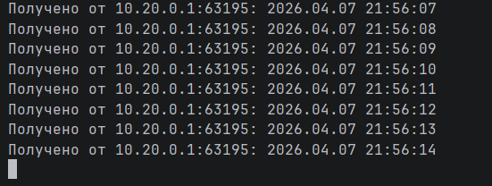

# Практика 4

## Часть 1

Чтобы получить бинарник из файла с кодом достаточно вызвать "go build <файл>". Также можно запускать файл без компиляции
командой "go run <файл>"

### Задание А

1\) выполнено в файле taskA/send_message.go

2, 3) выполнены в файле taskA/send_message_manual.go

#### Демонстрация

1) 
   
   
2) 
   
3) Mailtrap не предоставляет возможности посмотреть фото на сайте, но позволяет его скачать
   

### Задание Б

Выполнено в файлах taskB/remote_launch_server.go и taskB/remote_launch_client.go

#### Демонстрация

### Задание В

Выполнено в файлах taskC/server.go и taskC/client.go

#### Демонстрация

