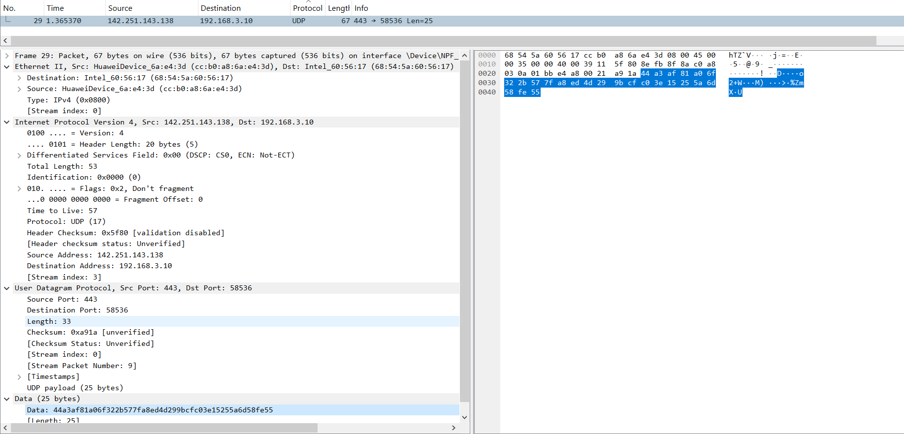
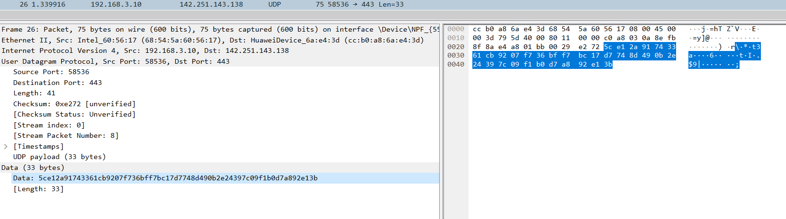
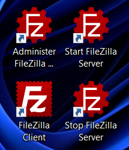
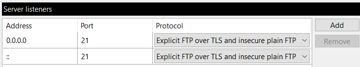
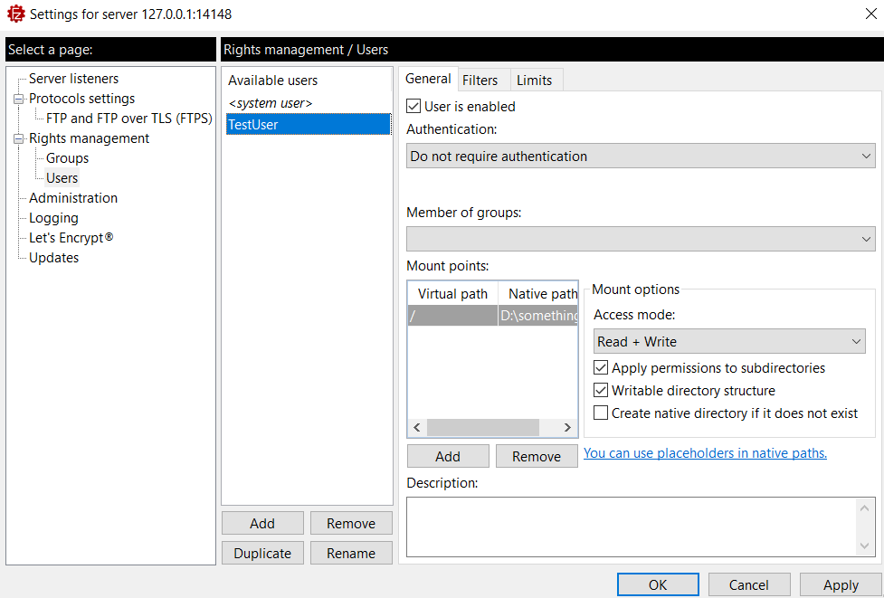
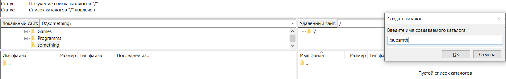
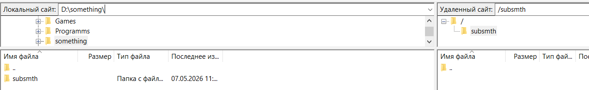
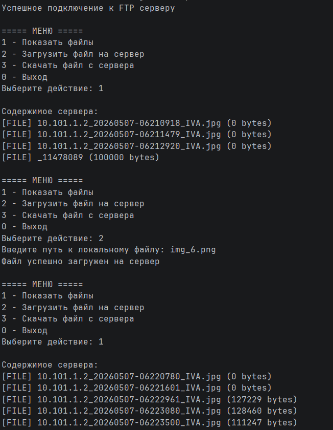
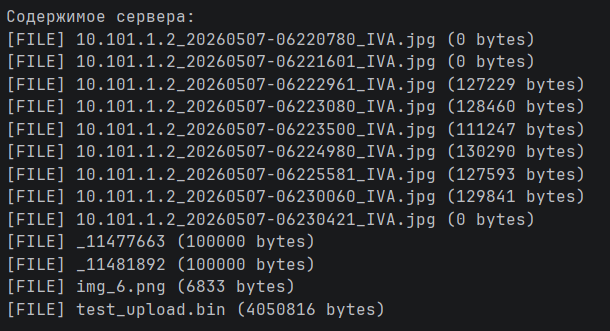
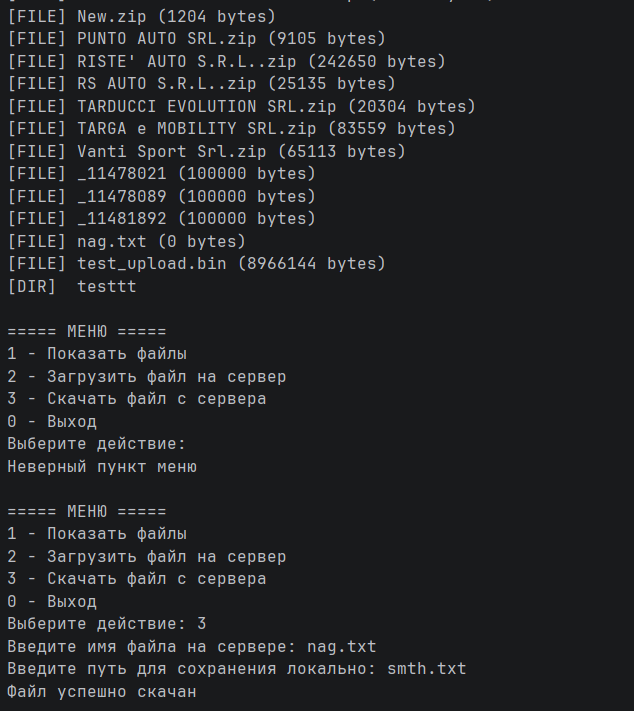

# Практика 6

## Wireshark

#### Ответы

1. UDP-заголовок содержит 19 полей
2. Поля имеют соответствующие длины (в байтах):
    * Destination - 6
    * Source - 6
    * Type - 2
    * Version - 0,5
    * Header Length - 0,5
    * Differentiated Services Field - 1
    * Total Length - 2
    * Identification - 2
    * Flags - 3/8
    * Fragment offset - 13/8
    * Time to Live - 1
    * Protocol - 1
    * Header Checksum - 2
    * Source Address - 4
    * Destination Address - 4
    * Source Port - 2
    * Destination Port - 2
    * Length - 2
    * Checksum - 2
3. Length - это длина части, относящейся к UDP-протоколу. То есть это сумма длины данных и длины UDP заголовка.
4. Total length не может превышать максимальное двухбайтовое число, при этом из них 28 байт всегда заняты заголовком.
   Значит размер полезных данных не превышает 65507 байт
5. Поле Source Port занимает 2 байта, а значит его максимальное значение - 65535
6. Номер протокола UDP = 17 = $11_{16}$
7. В этих пакетах Source Port и Destination Port меняются местами

## Программирование

### FileZilla

1. 
2. 
3. 
4. 
   
### FTP клиент 

задание выполнено в файле main.go

#### Демонстрация

