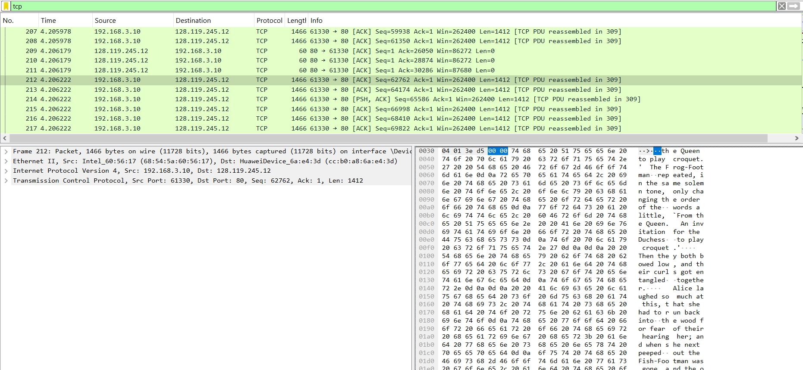
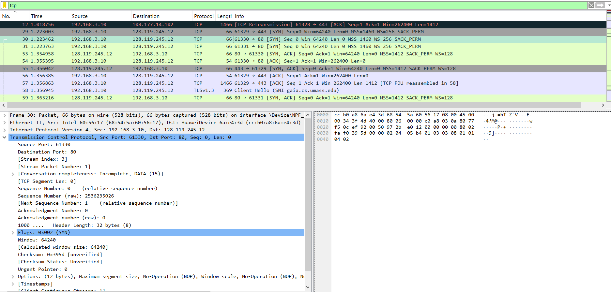
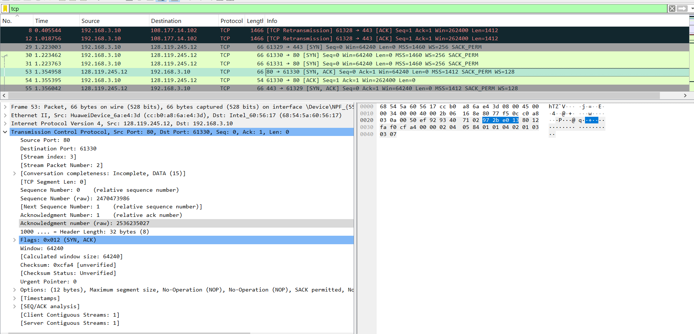
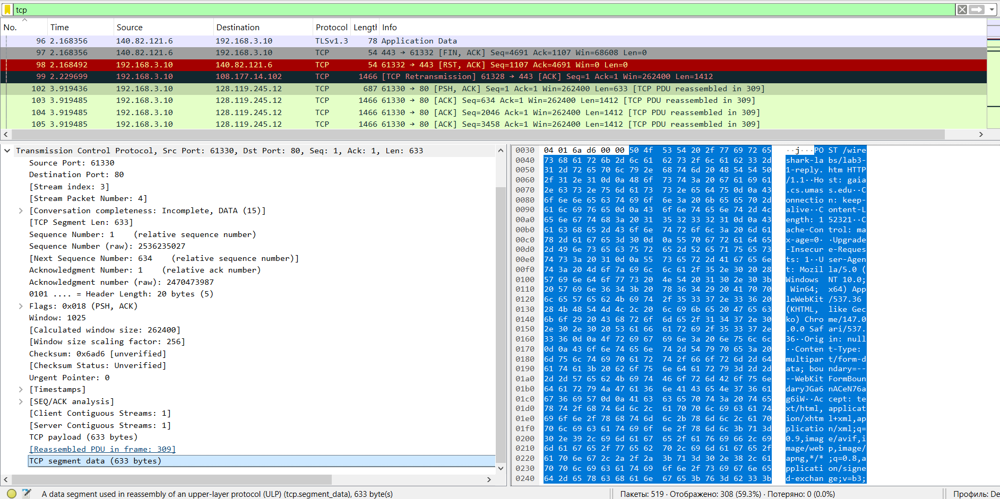
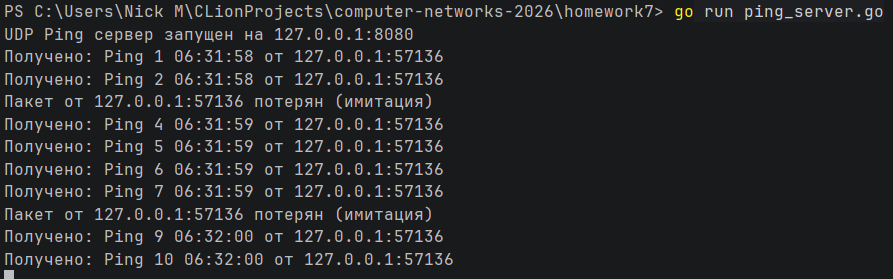
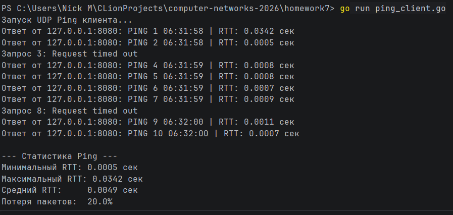

# Практика 7

## Wireshark

#### Ответы

1. 192.168.3.10:61330
2. Адрес 128.119.245.12, порты: отправки - 61330, приёма - 80
3. У начального SYN пакета 30 номер. Его можно определить по выставленному SYN флагу (0x002)
4. Номер SYNACK пакета - 53. В поле подтверждения хранится число 2536235027. Это следующее число после Sequence Number
   из SYN пакета. У этого пакета выставлены оба флага SYN и ACK (0x012)
5. Команду POST содержит 102й пакет
6. Первые 6 пакетов имеют номера от 102 до 107 (Stream Packet Number от 4 до 9). Вот времена отправления/получения и RTT:
   * 3.919436, 4.051163, 132 ms
   * 3.919485, 4.051419, 132 ms
   * 3.919485, 4.051419, 132 ms
   * 3.919485, 4.051419, 132 ms
   * 3.919485, 4.052040, 133 ms
   * 3.919485, 4.052706, 133 ms
7. Размер окна $\approx$ 3 * 1412 байт, RTT $\approx$ 132 ms, то есть пропускная способность $\approx$ 251 Кбит/с

## Программирование

### Сервер

Задание выполнено в файле ping_server.go

#### Демонстрация работы

### Клиент

Задание выполнено в файле ping_client.go

#### Демонстрация работы

