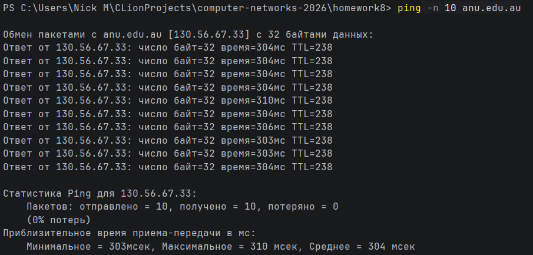
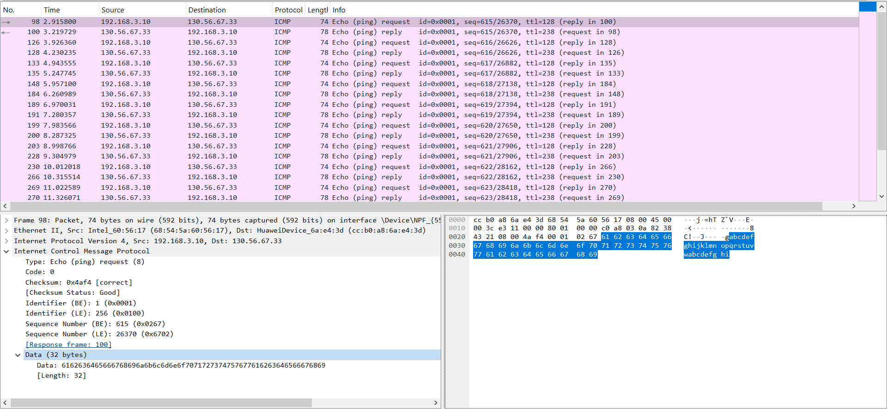
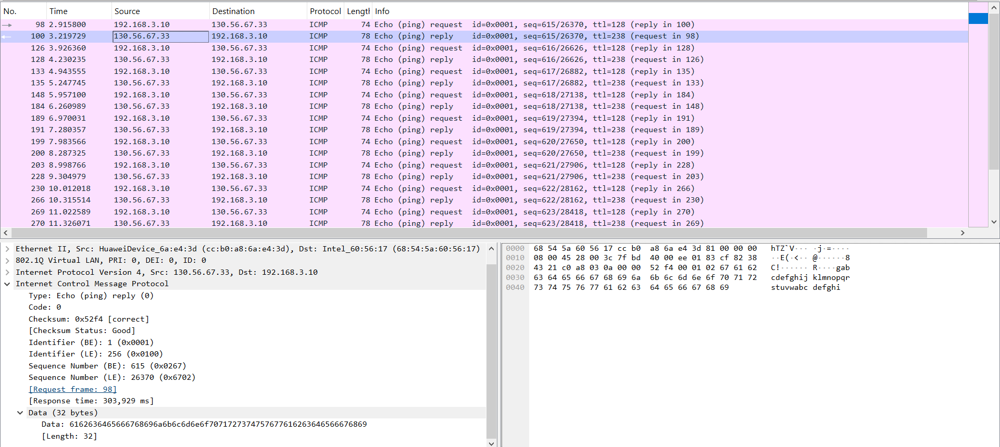
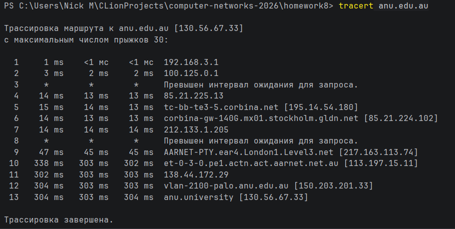
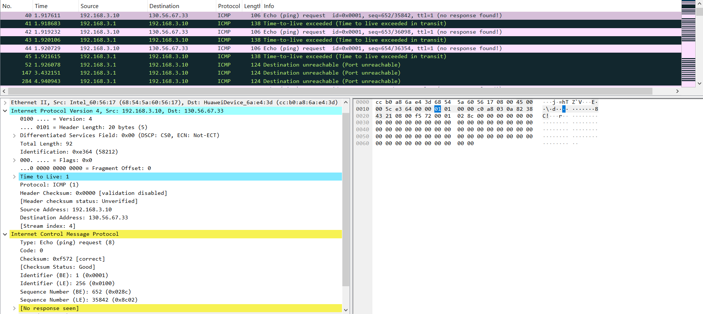
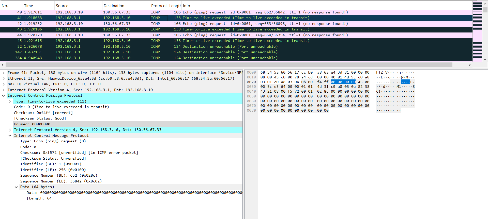
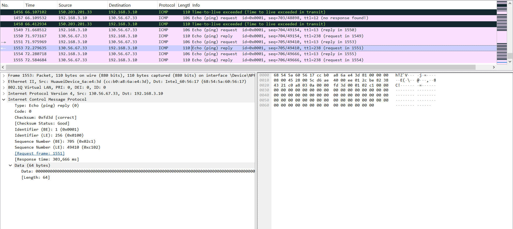
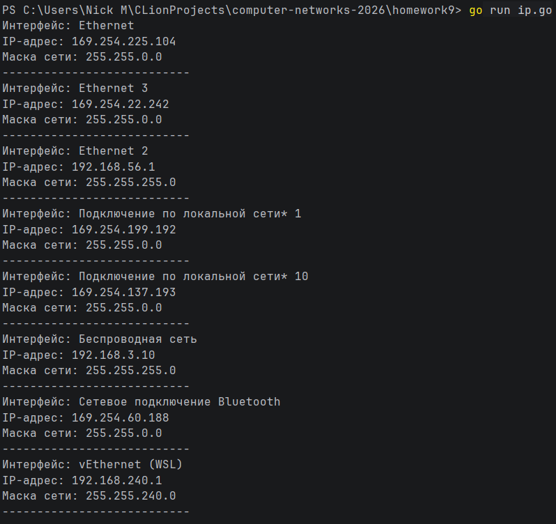
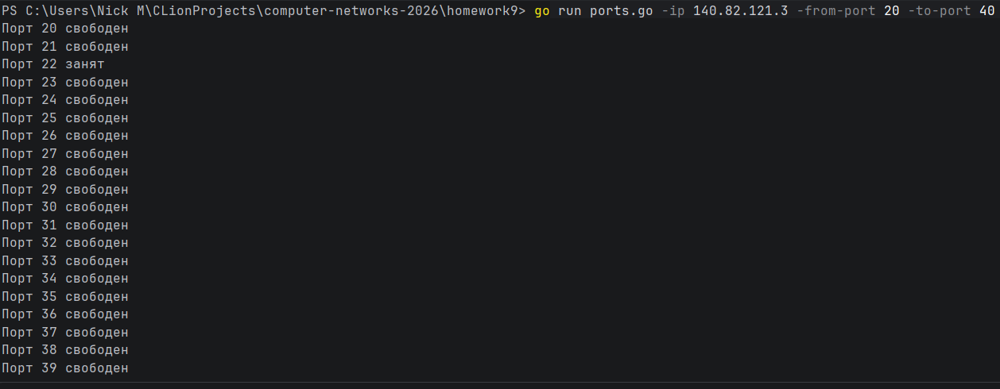

# Практика 9

## Wireshark: ICMP

### Ping

#### Ответы

1. 192.168.3.10 и 130.56.67.33 - IP-адресы моего хоста и хоста назначения соответственно
2. Номера портов являются атрибутом транспортного уровня протоколов TCP и UDP, а протокол ICMP действует на сетевом
   уровне
3. Тип пакета - Echo (ping) request, его код - 0. Помимо этих полей и поля данных в ICMP-пакете есть поля контрольной
   суммы, идентификатора, а также номера в последовательности, которые все имеют размер 2 байта.
4. Тип ответа - Echo (ping) reply, его код - 0. В этом ICMP-пакете такие же поля, как и в упомянутом выше. И на
   заголовочные поля выделено столько же места.

### Ping

#### Ответы

1. Не считая метаинформации о пакете от wireshark, пакет отличается ttl равным 1, в то время как в предыдущий раз ttl
   был 128.
2. Если у прошлых пакетов после контрольной суммы шёл идентификатор, то в этом идёт 4 неиспользуемых байта, а затем
   полностью дублируется (без Ethernet II заголовка) сообщение, на которое данное отвечает.
3. Последние сообщения, пришедшие от целевого хоста, не являются ошибками и поэтому по структуре совпадают с пакетами из
   предыдущего задания.
4. Да, в каждом канале задержка не превышает десятки мс, а вот канал, соединяющий
   AARNET-PTY.ear4.London1.Level3.net [217.163.113.74] и et-0-3-0.pe1.actn.act.aarnet.net.au [113.197.15.11], передавал
   сообщение около 100 мс. Хочется верить, что первый хост всё-таки расположен в Лондоне. А вот второй скорее всего
   находится в Acton (пригороде Канберры), т.е. в Australian Capital Territory.

## Программирование

### IP-адрес и маска сети

Задание реализовано в файле ip.go

#### Демонстрация работы

### Доступные порты

Задание реализовано в файле ports.go

#### Демонстрация работы

